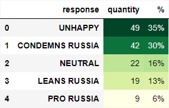

<h1 >  Data Glow Up </h1>

<blockquote>
    
 
        <b> Desafio 33:</b>  Dados Sobre a terrivel guerra que esta acontecendo entre UK e RU. 
    

    

        <b>Dados:</b> <a href='https://docs.google.com/spreadsheets/d/17YhLXD459Q8_8ez0aAl9EP4EbwgYndTDeMgJzvp5G_w/edit#gid=2011395717'> Ukraine-Russia War Graphics </a> 
         
        <b>Abas usadas: </b> Who Imports Russian Oil, Biggest Oil Producers, % Dependency on Russian Oil, Who Supports Russia?, 
    

</blockquote>

<h2> Ambientação </h2>

 A empresa de petróleo <b> PetroSA</b> da Arábia Saudita enfrenta o desafio de expandir seu mercado, buscando novas oportunidades de crescimento, diversificação e adaptação aos desafios emergentes. Reconhecendo a oportunidade de explorar novos mercados em outros países, a empresa está empenhada em identificar regiões com demanda crescente por energia e avaliar as condições políticas, econômicas e regulatórias para estabelecer operações bem-sucedidas. Ao buscar ativamente oportunidades em novos países, a empresa visa diversificar sua base de clientes e garantir seu crescimento sustentável no cenário global do setor petrolífero. 
 

 <b> Você como analista de dados desta empresa deve criar análises para entender quais as oportunidades e o potencial de ganho com essa expansão </b>  

<h2> Oportunidade </h2>

 Um dos maiores exportadores de Petróleo do mundo é a Rússia e atualmente a Rússia está em conflitos com a Ucránia e esses conflitos estão polarizando as opiniões relacionados ao país. 
Portanto, muitos países estão escolhendo um lado para apoiar.

Vamos visualizar a distribuição de como os países se sentem em relação a rússia:

 

 Sabendo que a a Rússia é uma das maiores exportadores de petróleo e que <b> 65% dos países não estão contentes com a Rússia (UNHAPPY e CONDEMNS RUSSIA) </b> significa que existe uma oportunidade para expandirmos a operação da <b> PetroSA </b> para fornecermos petróleo para países que estão insatisfeitos com a Rússia mas mesmo assim continuam importando o petróleo dela.  

<b>OBS: </b> <i> Lembrando que a Arabia Saúdita é um País Neutro em relação a Guerra que está acontecendo </i> 

<h2> Identificação de Potenciais Clientes </h2>

 Nosso objetivo é identificar quais <b> países importam petróleo da Rússia e estão descontentes com a Rússia </b> referente a Guerra. 

   
- <b> Expansão de receita: </b> Possibilidade de expansão de receita baseada na dependencia de Petróleo Russo. 
Exemplo: 56% do Petróleo usado na Turkya vem da Russia... E eles não estão feliz com a Russia, portanto é um cliente em potencial, podendo haver uma expansão de até $3.51B (Valor que a Turkya paga para a Russia sobre o Petróleo mesmo não estando feliz com a situação.)