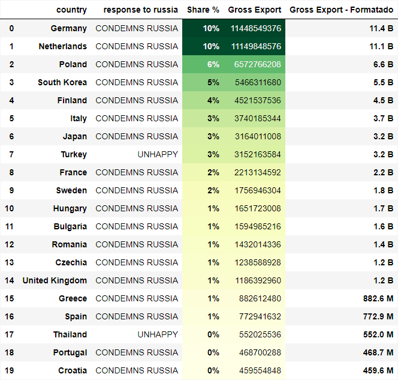

<h1 >  Data Glow Up </h1>

<blockquote>
    
 
        <b> Desafio 33:</b>  Dados Sobre a terrivel guerra que esta acontecendo entre UK e RU. 
    

    

        <b>Dados:</b> <a href='https://docs.google.com/spreadsheets/d/17YhLXD459Q8_8ez0aAl9EP4EbwgYndTDeMgJzvp5G_w/edit#gid=2011395717'> Ukraine-Russia War Graphics </a> 
         
        <b>Abas usadas: </b> Who Imports Russian Oil, Biggest Oil Producers, % Dependency on Russian Oil, Who Supports Russia?
    

</blockquote>

<h2> Sumário </h2>
<ol>
    <li> <a href='#ambientacao'> Ambienteção </a> </li>
    <li> <a href='#oportunidade'> Oportunidade </a> </li>
    <li> <a href='#tamanho'> Qual o tamanho dessa oportunidade ? </a> </li>
    <li> <a href='#resultado'> Resultado </a> </li>
    <li> <a href='#conclusao'> Conclusão </a> </li>
</ol>

 
 

<h2 id='ambientacao'> Ambientação </h2>

 A empresa de petróleo <b> PetroSA</b> da Arábia Saudita enfrenta o desafio de expandir seu mercado, buscando novas oportunidades de crescimento, diversificação e adaptação aos desafios emergentes. Reconhecendo a oportunidade de explorar novos mercados em outros países, a empresa está empenhada em identificar regiões com demanda crescente por energia e avaliar as condições políticas, econômicas e regulatórias para estabelecer operações bem-sucedidas. 
 

 <b> Você como analista de dados desta empresa deve criar análises para entender quais as oportunidades e o potencial de ganho com essa expansão </b> 

 

<h2 id='oportunidade'> Oportunidade </h2>

 Um dos maiores exportadores de Petróleo do mundo é a Rússia que atualmente está em conflitos com a Ucránia e esses conflitos estão polarizando as opiniões relacionados ao país. 
Portanto, muitos países estão escolhendo um lado para apoiar.

Vamos visualizar a distribuição de como os países se sentem em relação a rússia:

 

 Sabendo que a a Rússia é um dos maiores exportadores de petróleo e que <b> 65% dos países não estão contentes com a Rússia (UNHAPPY e CONDEMNS RUSSIA) </b> significa que existe uma oportunidade para expandirmos a operação da <b> PetroSA </b> para fornecermos petróleo para países que estão insatisfeitos com a Rússia mas mesmo assim continuam importando o petróleo dela.  

<b>OBS: </b> <i> Lembrando que a Arabia Saúdita é um País Neutro em relação a Guerra que está acontecendo </i> 

 

<h2 id='tamanho'> Qual o tamanho dessa oportunidade ? </h2>

 Sabendo que existem muitos países insatisfeitos com a rússia, precisamos entender qual o potencial de mercado que existe relacionado aos <b> países importam petróleo da Rússia e estão descontentes com a Rússia </b> referente a Guerra. 

 Vamos visualizar os países que importam Petróleo da Rússia e estão descontentes com a situação 

 

 <b>OBS: </b> <i> Share % é o percentual do Petróleo Russo. (100% é todo o petróleo que a Russia exporta)  </i>  

 A partir dessa listagem conseguimos verificar que existem muitos países que importam petróleo da Rússia e que estão insatisfeitos, ou seja, <b> esses países são potenciais clientes para expandir a operação da PetroSA para outros países. </b> 

 

<h2 id='resultado'> Resultados </h2>

 Ao análisar os dados anteriores podemos extrair insights como 

<ul>
    <li>
    <b> Clientes Insátisfeitos:  </b> 
    Como visualizado existem muitos países insatisfeitos com a Rússia mas continuam importando petróleo, gerando assim uma abertura para a PetroSA entrar nesse mercado.
    </li>
 
    <li>
    <b> Potencial do mercado:  </b> 
    Existe um mercado de até <b>$ 65.3 B </b> referente aos países que importam petróleo da Rússia mesmo estando descontentes com o país. 

    </li>
 
    <li> <b>  Localização: </b> A grande parte desse mercado está concentrado na <b> Europa. </b>   </li>
</ul>

 

<h2 id='conclusao'> Conclusão </h2>

 
    Entendendo o objetivo da PetroSA de expandir sua área de atuação para novos países ao analisarmos a situação atual referente a guerra entre a Rússia e a Ucrânia é possivel visualizar os impactos desta guerra em diversas áreas como no ramo petrólifico. 

 
    Ao analisar os dados referentes a guerra e seus impactos torna-se vísivel uma oportunidade para a PetroSA expandir seu mercado iniciando as operações na Europa. Essa oportunidade é justificada através da quantidade de países insatisféitos com a Rússia mas que continuam importando petróleo com a Rússia. 

 
    Portanto, esses países tornam-se potenciais clientes para serem abordados, pois existe uma chance muito grande substituirem o fornecedor de petróleo, paises como a Alemanha e Países Baixos (Germany and netherlands) onde cada um importa mais de $ 10 B em petróleo russo.

 
    Essa é uma ótima oportunidade para a PetroSA expandir suas operações visando esses potenciais clientes, o potencial deste mercado consiste em $ 65.3 B, sendo este o valor total importando em petróleo russo por países que não apoiam a Rússia. Recomendo fortemente que sejam criada ações para expandirmos as operações e com isso obter uma fátia desse mercado gigantesco.

